# PrusaConnect ESP32-CAM

For Web cameras in the PrusaConnect is launched a WEB page on the Android/IOS/laptop device, which then sending photos from the camera to the prusaconnect backend.

Here is the implementation of a WEB camera for prusa connect, where the ESP32-CAM board is programmed in the arduino IDE as a WEB camera via WI-FI.

What we need for functionality
- ESP32-CAM AI-thinker board with OV2640 camera module [ here ](#esp32)
- Arduino IDE
- Install the necessary libraries in the Arduino IDE [ here ](#arduino)
- Get Token ID and Fingerprint from new camera in the PrusaConnect [ here ](#token_finger)
- Get an ISRG Root X1 certificate for the PrusaConnect site [ here ](#cert)
- How to configure [ESP32_PrusaConnectCam](https://github.com/johnyHV/PrusaConnect_ESP32-CAM/tree/master/ESP32_PrusaConnectCam) SW [ here ](#mcu_10)
- How to configure [ESP32_PrusaConnectCam_web](https://github.com/johnyHV/PrusaConnect_ESP32-CAM/tree/master/ESP32_PrusaConnectCam_web) SW with WEB interface [ here ](#mcu_web)

<a name="esp32"></a>
## ESP32-CAM AI-thinker board 
It's few dolars board with **ESP32** MCU and Camera. It's neccesary buy board with **camera module OV2640**. the board is sold without a programmer as standard. It is possible to program it using the FTDI USB to UART converter, or buy an original programmer for the board. I recommend buying a programmer for the board. It can save a lot of trouble with connecting and programming the board.


In the next picture we can see **ESP32-CAM** board and programator for board. Currently price for **ESP32-CAM** board with programmer is 6eur with shippig from aliexpress.


You must have a camera version **OV2640**. in the case of a different camera, it is necessary to modify the camera's pinout, and some camera settings may not work correctly

<a name="arduino"></a>
## Necessary libraries in the Arduino IDE
On the Internet there are many good instructions on how to install libraries and support for the ESP-32 board to Arduino IDE. So I will describe it only briefly

At the first step we need install to Arduino IDE support for ESP32 board. **file-> preferences -> additional boards managers URLs**
 ```
 https://raw.githubusercontent.com/espressif/arduino-esp32/gh-pages/package_esp32_index.json
 ```
 then go to **Tools -> Board -> Boards Manager...** and install module **ESP32** by **Espressif Systems**

Then we can select board version **Tools -> Board -> ESP32 Arduino -> AI Thinker ESP32**

**Apps/module versions used for development**
- [Arduino IDE 1.8.19](https://www.arduino.cc/en/software)
- [ESP32 2.0.11](https://github.com/espressif/arduino-esp32)
- [ESPAsyncWebSrv 1.2.6](https://github.com/dvarrel/ESPAsyncWebSrv)
- [AsyncTCP 1.1.4](https://github.com/dvarrel/AsyncTCP)

<a name="token_finger"></a>
## How to get fingerprint and token ID
**Step 1.** Go to [PrusaConnect WEB page](https://connect.prusa3d.com/) . Then in the **left side** click to **Cameras**. And click to **"ADD NEW CAMERA"**

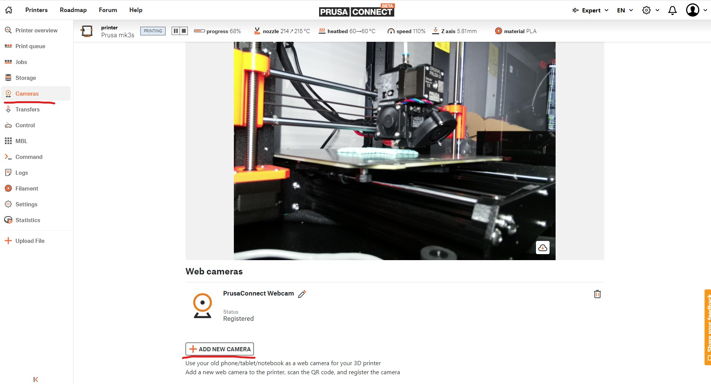

**Step 2.** Next step is click to **QR code**. 


**Step 3.** After click to QR code, is automatically open new window in the browser. (my laptop camera is covered, that's why you see a black screen)

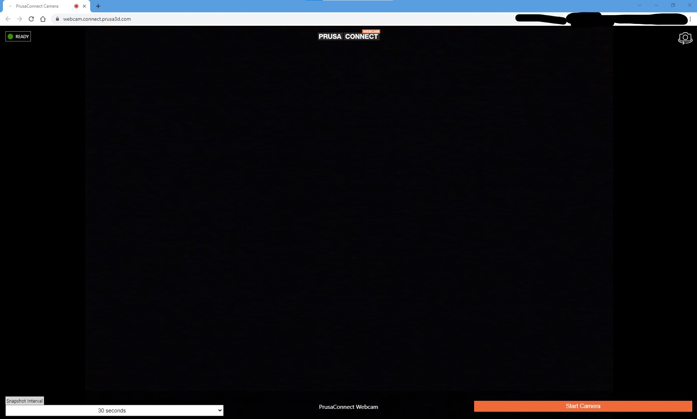

**Step 4.** In the new window, is in the bottom right side button **"Start camera"**. Click to **"Start camera"** and go to **developer mode** in the **browser** (for developer mode in the chrome, we can use F12). 


**Step 5.** Now please go to section **"Application"**, and in the left side section **Storage -> Local Storage -> https://webcam.connect.prusa3d.com** . And here we can see variables **fingerprint** and **token**. **Please copy the values**


<a name="cert"></a>
## ISRG Root X1 certificate for the PrusaConnect site
Currently the source code contains the correct certificate. Well, in a few steps I will show you how to get an ISRG Root X1 certificate if necessary.

Go to site [PrusaConnect camera](https://webcam.connect.prusa3d.com) and click on the **lock**

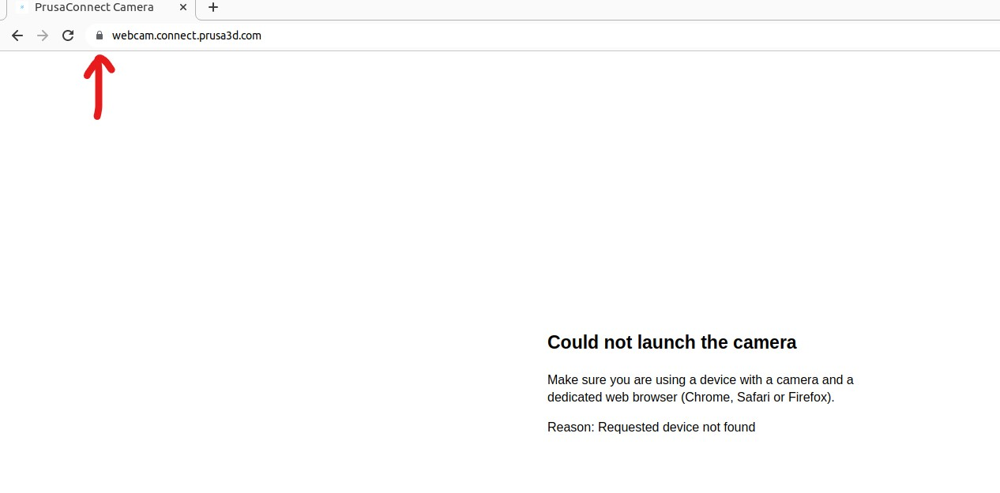

then go to **"Connection is secure"**

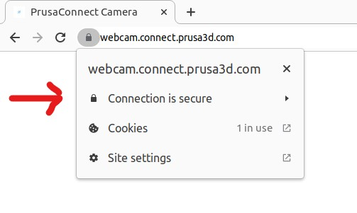

and **"Certificate is valid"**


click on the tab **"Details"**

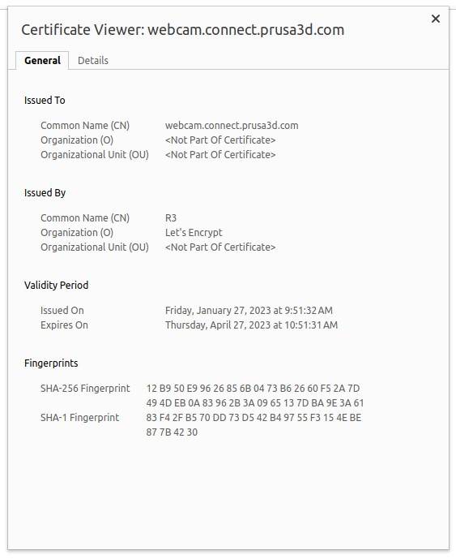

Here we can see ISRG Root X1. Please click to the first line **"BuiltIn Object Token: ISRG Root X1"**, click to the **"Export"** and save certificate to the hard drive.

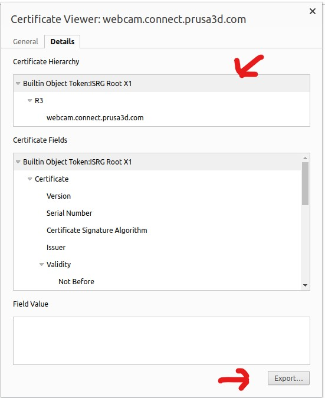

Now we can open the certificate in a text editor and save it in the source code


<a name="mcu_10"></a>
## How to configure MCU
Board version is **Tools -> Board -> ESP32 Arduino -> AI Thinker ESP32**. In the source code we can see several variable

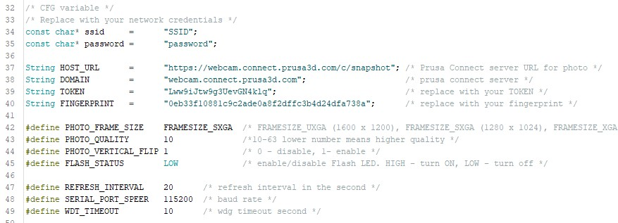

the most important variables are
- **ssid** -> WI-FI network SSID
- **password** -> password for WI-FI network
- **TOKEN** -> here is necessary  save token ID variable from prusaconnect WEB page
- **FINGERPRINT** -> here is necessary  save fingerprint variable from prusaconnect WEB page

other variables are
- **PHOTO_FRAME_SIZE** -> this variable defined photo resolution. If the photo is too large (capacity size), the prusa connect website may reject the photo
- **PHOTO_QUALITY** -> defined photo quality. 10 is best, 63 is the worst
- **PHOTO_VERTICAL_FLIP** -> photo vertical flip
- **FLASH_STATUS** -> LED status. HIGH - Led is ON, LOW - Led is off
- **REFRESH_INTERVAL** -> how often is a photo uploaded to the prusa connect website. Uploading photos too often can cause increased costs for the Prusa company to operate the server. The setting in the official camera is 10,20,30 seconds.
- **SERIAL_PORT_SPEER** -> baud rate for serial port
- **WDT_TIMEOUT** -> watchdog timeout interval. if the software freezes, then the watchdog restarts the processor after a defined time interval. Currently, the value is set to 10 seconds

in the file **Certificate.h** is stored **ISRG Root X1 certificate**

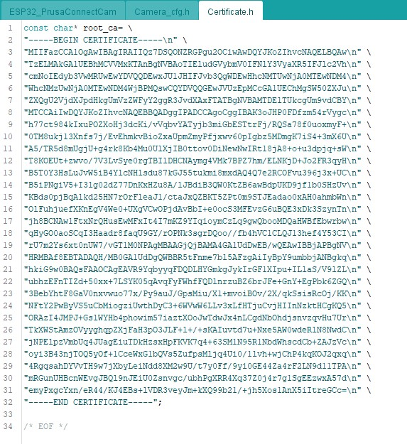

<a name="mcu_web"></a>
## How to configure MCU with WEB interface
Board version is **Tools -> Board -> ESP32 Arduino -> AI Thinker ESP32**. In the source code we can see several variable

This SW version use **WEB interface** for settings **token** and **fingerprint** variable. And there is an added option to turn **on/off the LED** using the WEB page. All variables is stored in the internal **FLASH memory**. 

- change the WI-FI ssid and password for WI-FI (line 30 and 31 on the file ESP32_PrusaConnectCam_web.ino). 
- compile the code and upload it to the MCU
- open the serial console and wait until the IP address of the WEB server is displayed

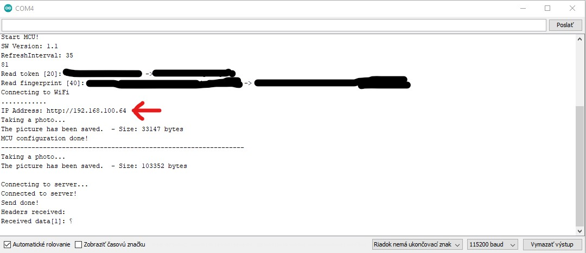

- now you can go to the WEB page and set the token and fingerprint. On the root page it's possible configuration camera parameters like as photo quality, photo size, photo vertical flip or horizontal mirror and so on

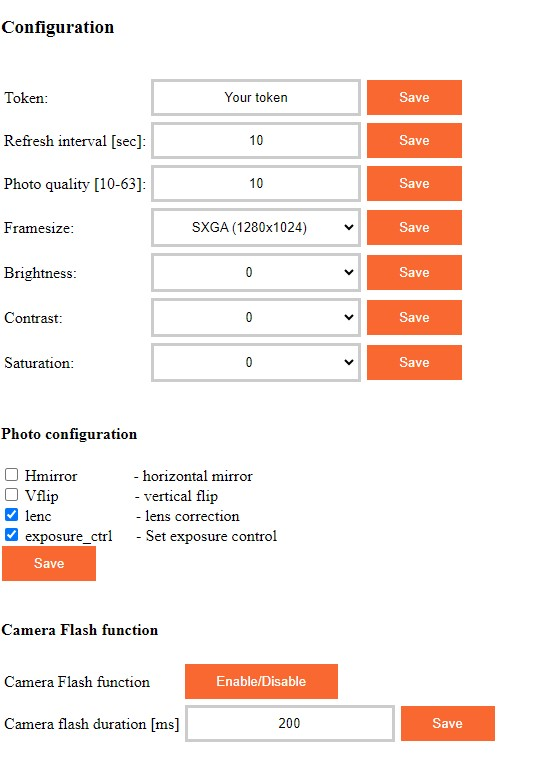

- the page also shows the current MCU configuration. The configuration is stored in the internal memory of the MCU

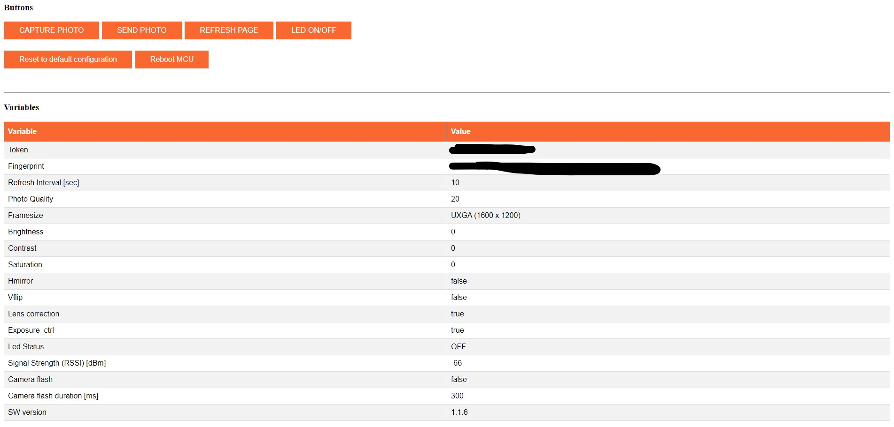

# Changelog
- 24.2.2023 - Init repository
- 25.2.2023 - added **ESP32_PrusaConnectCam** app **version 1.0** (the source code is not optimal, but it is functional)
- 25.2.2023 - added documentation
- 27.2.2023 - added version of the application with WEB interface for MCU configuration **ESP32_PrusaConnectCam_web**. app **version 1.1**
- 6.4.2023  - added several parameters for camera configuration for **ESP32_PrusaConnectCam_web**. app **version 1.1.2**
- 6.4.2023  - fix issue with default configuration, added RSSI information on the root WEB page about signal quality for **ESP32_PrusaConnectCam_web**. app **version 1.1.3**

# TO-DO
- add additional parameters for camera configuration
